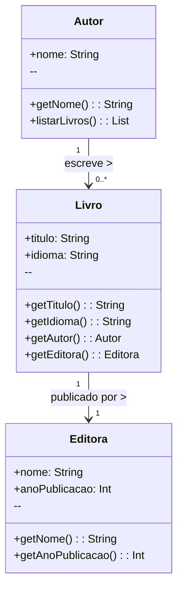

<h1 align="center" style="font-weight: bold;">Acervo.me 📚</h1>

<p align="center">
 <a href="#tech">Tecnologia</a> • 
 <a href="#diagram">Diagrama de Classe</a> • 
 <a href="#started">Como Executar o Projeto</a> •
 <a href="#contribute">Contribuição</a>
</p>

<p align="center">
    <b>O objetivo do sistema Acervo.me é catalogar todo o acervo pessoal armazenado nas estantes de nossas residências e permitir que esse catálogo seja compartilhado com familiares, amigos, colegas e demais pessoas que possuam interesses em comum.</b>
</p>

<h3 id="tech">💻 Tecnologia</h3>

- Java
- Spring Boot
- MySql

<h3 id="diagram">
 Diagrama de Classe</h3>





<h3 id="started">🚀 Como Executar o Projeto </h3>

<h3>Pré-requisitos</h3>

Antes de começar, verifique se você possui instalado:

- [Java 17 +](https://www.oracle.com/java/technologies/javase/jdk17-archive-downloads.html)
- [Spring Boot 3 +](https://docs.spring.io/spring-boot/installing.html)
- [MySql](https://dev.mysql.com/downloads/mysql/)
- [Git](https://git-scm.com/install)

<h3>📂 Clonando o Repositório</h3>

Como clonar o projeto:

```bash
git clone https://github.com/TechCodeDri/Projeto_acervo.me.git
```
<h3>📂 Acessando o Diretório</h3>

```bash
cd Projeto_acervo.me
```


<h3>🗄️Configurando Banco de Dados</h3>

```sql
CREATE DATABASE acervome;

```

Configure usuário e senha no arquivo:
<br>
🔑 src/main/resources/application.properties

<h3>📍 Executando o Projeto </h3>

Com Maven wrapper:
```bash
./mvnw spring-boot:run

```

Ou, com Maven instalado:

```bash
mvn spring-boot:run

```

O sistema será iniciado em:

➡ [http://localhost:8080](http://localhost:8080)

<h3 id="contribute">🤝 Como Contribuir</h3>

1. Faça um fork do projeto
2. Crie uma branch para sua feature
3. Envie um pull request descrevendo suas alterações

<h3>📄 Licença</h3>

Este projeto está sob a licença MIT.
Você pode modificar, distribuir e usar livremente.

<br>


