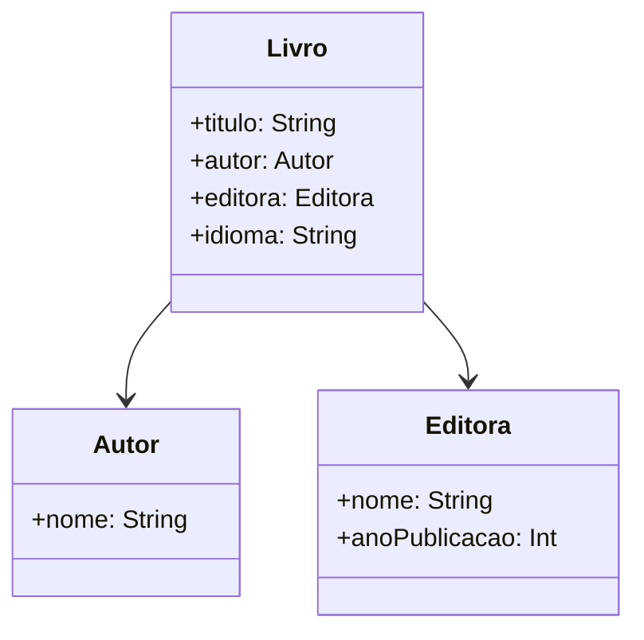

# Projeto_acervo.me
Projeto Pessoal: acervo.me

### Projeto API REST local usando base de Dados MySql, Spring Boot 3, Java 17 

#### Diagrama de Classe do acervo.me

```mermaid
classDiagram
  class Livro {
    +titulo: String
    +autor: Autor
    +editora: Editora
    +idioma: String
  }

  class Autor {
    +nome: String
  }

  class Editora {
    +nome: String
    +anoPublicacao: Int
  }

  Livro --> Autor
  Livro --> Editora
```
